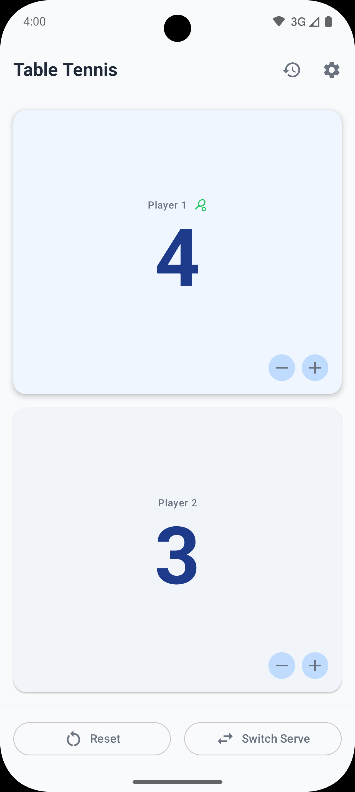
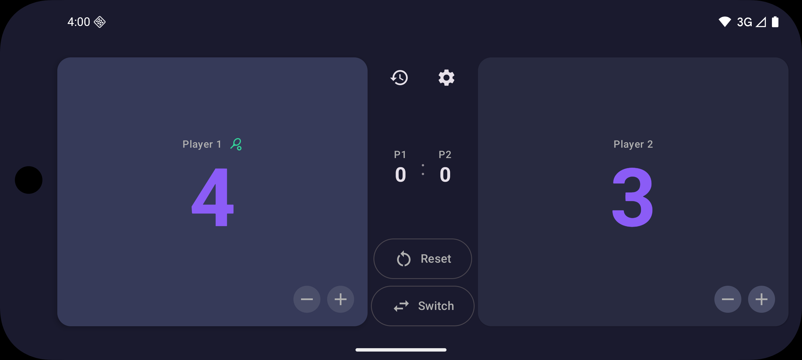

# Score-Count

[](https://github.com/VictorHerreraO/Score-count/actions/workflows/release-build.yml) [](LICENSE)

Welcome to Score-Count! This application provides a simple and intuitive way to keep track of scores during table tennis matches. Whether you're playing a casual game with friends or a more competitive match, Score-Count helps you focus on the game without worrying about scorekeeping.

## Table of Contents

- [Features](#features)
- [Screenshots](#screenshots)
- [Tech Stack & Architecture](#tech-stack--architecture)
- [How to Build](#how-to-build)
- [Contributing](#contributing)
- [License](#license)
- [Roadmap (Future Enhancements)](#roadmap-future-enhancements)

## Features

*   **Score Tracking:** Increment and decrement scores for two players.
*   **Set and Serve Management:** Automatically tracks sets won and indicates the current server.
*   **Game State Persistence:** Your current game is automatically saved, so you can pick up where you left off.
*   **Match History:** Review a list of your past matches.
*   **Customizable Rules:** Adjust game settings like points to win a set.
*   **Reset:** Easily reset the score for a new game.

## Screenshots

*(Coming Soon! Add screenshots of the main app screens here.)*

 

## Tech Stack & Architecture

*   **Programming Language:** [Kotlin](https://kotlinlang.org/)
*   **UI Toolkit:** [Jetpack Compose](https://developer.android.com/jetpack/compose) for a modern, declarative UI.
*   **Architecture:** Follows Google's recommended [Guide to App Architecture](https://developer.android.com/topic/architecture), promoting a clean, scalable, and testable codebase.
    *   **UI Layer:** Built with Jetpack Compose, using State-driven ViewModels.
    *   **Domain Layer:** Contains business logic encapsulated in Use Cases.
    *   **Data Layer:** Manages data using the Repository pattern.
*   **Asynchronous Programming:** [Kotlin Coroutines](https://kotlinlang.org/docs/coroutines-guide.html) and [Flow](https://developer.android.com/kotlin/flow) for managing background threads and data streams.
*   **Dependency Injection:** [Hilt](https://dagger.dev/hilt/) for managing dependencies.
*   **Data Persistence:**
    *   [Room](https://developer.android.com/training/data-storage/room) for storing match history in a local SQLite database.
    *   [Proto DataStore](https://developer.android.com/topic/libraries/architecture/datastore) for persisting game state and user settings.

## How to Build

Follow these instructions to get a copy of the project up and running on your local machine for development and testing purposes.

### Prerequisites

*   Android Studio (Latest stable version recommended)
*   JDK (Java Development Kit) 17 or higher

### Steps

1.  **Clone the repository:**
    ```bash
    git clone https://github.com/soyvictorherrera/score-count.git
    cd score-count
    ```

2.  **Set up pre-commit hook (optional but recommended):**

    This project uses ktlint for code formatting and detekt for static code analysis. The pre-commit hook automatically runs these checks before each commit.

    ```bash
    cat > .git/hooks/pre-commit << 'EOF'
    #!/bin/bash
    # Code quality pre-commit hook
    # Runs ktlint formatting and detekt static analysis before commit

    echo "Running code quality checks on staged files..."

    # Get list of staged Kotlin files
    STAGED_KOTLIN_FILES=$(git diff --cached --name-only --diff-filter=ACMR | grep -E '\.kt$|\.kts$' || true)

    if [ -z "$STAGED_KOTLIN_FILES" ]; then
        echo "No Kotlin files to check"
        exit 0
    fi

    # Step 1: Run ktlint format on all files
    echo "1/2 Running ktlint format..."
    ./gradlew ktlintFormat --quiet

    # Check ktlint status
    if [ $? -ne 0 ]; then
        echo "❌ ktlint format failed. Please fix the issues and try again."
        exit 1
    fi

    # Re-add formatted files to staging
    for file in $STAGED_KOTLIN_FILES; do
        if [ -f "$file" ]; then
            git add "$file"
        fi
    done

    echo "✅ ktlint format completed successfully"

    # Step 2: Run detekt static analysis
    echo "2/2 Running detekt static analysis..."
    ./gradlew detekt --quiet

    # Check detekt status
    if [ $? -ne 0 ]; then
        echo "❌ detekt found code quality issues. Please review the report at:"
        echo "   app/build/reports/detekt/detekt.html"
        echo "   Fix the issues or update the baseline if appropriate."
        exit 1
    fi

    echo "✅ detekt analysis passed"
    echo "✅ All code quality checks passed successfully"
    exit 0
    EOF

    chmod +x .git/hooks/pre-commit
    ```

3.  **Open in Android Studio:**
    *   Open Android Studio.
    *   Click on "Open" or "Open an Existing Project".
    *   Navigate to the cloned `score-count` directory and select it.

4.  **Build and Run:**
    *   Let Android Studio sync the project and download dependencies.
    *   Click the "Run" button (green play icon) or select "Run" > "Run 'app'" from the menu.
    *   Choose an available emulator or a connected physical device.

### Code Quality

This project uses multiple code quality tools to ensure clean, maintainable code:

#### Continuous Integration

All pull requests are automatically validated using GitHub Actions. The CI pipeline runs the following checks:

1. **Build Compilation** - Verifies code compiles without errors
2. **Test Compilation** - Ensures test code compiles correctly
3. **Unit Tests** - Runs the full test suite
4. **Lint Checks** - Android lint analysis
5. **Code Formatting** - ktlint validation
6. **Static Analysis** - detekt code quality checks

Pull requests must pass all checks before merging. You can run these checks locally to catch issues early:

```bash
# Run all checks (same as CI)
./gradlew clean build test lint ktlintCheck detekt
```

#### ktlint (Code Formatting)
Automatically formats Kotlin code according to the official Kotlin coding conventions.

```bash
./gradlew ktlintCheck    # Check code formatting
./gradlew ktlintFormat   # Auto-fix formatting issues
```

#### detekt (Static Code Analysis)
Analyzes Kotlin code for code smells, complexity issues, and potential bugs.

```bash
./gradlew detekt              # Run static code analysis
./gradlew detektBaseline      # Update baseline for existing violations
```

**Understanding detekt Reports:**
- Reports are generated in `app/build/reports/detekt/`
- `detekt.html` - Detailed HTML report with findings and suggestions
- `detekt.xml` - XML report for CI/CD integration
- The baseline file (`detekt-baseline.xml`) tracks known violations to focus on new code quality

**Common detekt Findings:**
- **Complexity**: Functions or classes that are too complex
- **Code Smells**: Patterns that may indicate deeper problems
- **Style**: Kotlin idiom and best practice violations
- **Performance**: Potential performance improvements

The `.editorconfig` file contains project-wide style rules that are automatically applied by most IDEs.

#### Configuration Files
- `.editorconfig` - IDE code style settings
- `detekt.yml` - detekt static analysis rules
- `detekt-baseline.xml` - Baseline of known violations (auto-generated)
- `.github/workflows/pr-checks.yml` - CI/CD pipeline configuration

## Contributing

Contributions are what make the open-source community such an amazing place to learn, inspire, and create. Any contributions you make are **greatly appreciated**.

If you have a suggestion that would make this better, please fork the repo and create a pull request. You can also simply open an issue with the tag "enhancement".

1.  Fork the Project
2.  Create your Feature Branch (`git checkout -b feature/AmazingFeature`)
3.  Commit your Changes (`git commit -m 'Add some AmazingFeature'`)
4.  Push to the Branch (`git push origin feature/AmazingFeature`)
5.  Open a Pull Request

## License

This project is licensed under the MIT License - see the `LICENSE.md` file for details.

Icon: layer by Cahya Kurniawan from [Noun Project](https://thenounproject.com/browse/icons/term/layer/) (CC BY 3.0)

---
